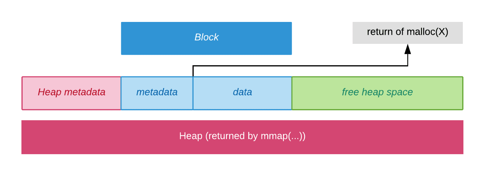

# WRITE FREE, MALLOC AND REALLOC FUNCTIONS IN C

## COMPREHENSION DU SUJET :

les fonctions
le cadre/plan
les tests unitaires

### mmap/munmap

- Les fonctions `mmap` et `munmap` sont utilisées pour créer et supprimer des mappings mémoire, respectivement. Ces fonctions sont souvent utilisées pour la gestion avancée de la mémoire dans les programmes C, notamment lors de l'allocation et de la libération de mémoire de manière personnalisée.

```c
void *mmap(void *addr, size_t length, int prot, int flags, int fd, off_t offset);

void *ptr = mmap(NULL, 4096, PROT_READ | PROT_WRITE, MAP_PRIVATE | MAP_ANONYMOUS, -1, 0);
```

- `mmap` crée un nouveau mapping dans l'espace d'adressage virtuel du processus appelant.
addr spécifie l'adresse de départ du nouveau mapping. Si addr est NULL, le noyau choisit l'adresse (alignée sur une page) où créer le mapping.
- `addr` spécifie l'adresse de départ du nouveau mapping. Si addr est NULL, le noyau choisit l'adresse (alignée sur une page) où créer le mapping.
- `length` spécifie la longueur du mapping.
- `prot` décrit la protection mémoire désirée pour le mapping.
- `flags` détermine si les mises à jour du mapping sont visibles pour d'autres processus et si elles sont reportées dans le fichier sous-jacent.
- `fd` est le descripteur de fichier du fichier (ou autre objet) à mapper.
- `offset` est le décalage dans le fichier où commence le mapping.

Attributs de Protection (prot)
PROT_EXEC: Autorise l'exécution de code dans la zone mémoire.
PROT_READ: Autorise la lecture de la zone mémoire.
PROT_WRITE: Autorise l'écriture dans la zone mémoire.
PROT_NONE: Zone mémoire inaccessible.

```c
int munmap(void *addr, size_t length);

munmap(ptr, 4096);
```

- `munmap` supprime les mappings pour la plage d'adresses spécifiée.
- `addr` est l'adresse de départ du mapping à supprimer.
- `length` est la longueur de la plage à désallouer.

### getpagesize

- La fonction `getpagesize()` est une ancienne fonction système qui a été largement remplacée par la fonction `sysconf(_SC_PAGESIZE)` pour obtenir la taille de la page mémoire. Elle renvoie le nombre d'octets dans une page mémoire, où une "page" est un bloc de longueur fixe utilisé pour l'allocation de mémoire et le mappage de fichiers effectués par `mmap(2)`


```c
#include <stdio.h>
#include <unistd.h>

int main() {
    int page_size = getpagesize(); // obsolete

    printf("Page size: %d bytes\n", page_size);

    long spage_size = sysconf(_SC_PAGESIZE); // a jour

    if (spage_size == -1) {
        perror("sysconf");
        return 1;
    }

    printf("Page size: %ld bytes\n", spage_size)

    return 0;
}
```
### getrlimit()


- La fonction `getrlimit(int resource, struct rlimit *rlim)` : Obtient les limites de ressources d'un processus associées à un certain type de ressource (défini par le paramètre resource). Les limites sont stockées dans une structure rlimit contenant deux champs : rlim_cur pour la limite souple (soft limit) et rlim_max pour la limite dure (hard limit).

```c
#include <stdio.h>
#include <sys/resource.h>

int main() {
    struct rlimit stack_limit;

    if (getrlimit(RLIMIT_STACK, &stack_limit) == -1) {
        perror("getrlimit");
        return 1;
    }

    printf("Soft stack limit: %ld\n", (long) stack_limit.rlim_cur);
    printf("Hard stack limit: %ld\n", (long) stack_limit.rlim_max);

    return 0;
}

```

## MALLOC

- Les variables globales et static sont stockees durant toute la duree de l'execution du programme alors que les variables en local sont stockees dans la stack, cree puis detruit a chaque appels ou return de fonctions. 

- 2 problemes:
    - la taille de l'allocation doit etre set a la compilation
    - la duree de vie d'une variable ne peut pas etre ajustee, il n'est pas possible de choisir quand les creer ou les supprimer.

VOILA PQ ON UTILISE MMAP POUR SPECIFIER LA TAILLE

1. Utilisation de mmap : La fonction malloc utilise le système call mmap pour allouer un nouveau `bloc de mémoire`. mmap est utilisée pour mapper la memoire physique vers des addresses virtuelles et il retourne un pointeur vers le début de cette zone.

2. Structures de données : Le développeur utilise des structures pour gérer la mémoire allouée. Un bloc de mémoire alloué est appelé un "heap", et un heap est constitué de "blocks". Chacun de ces blocs et heaps a des métadonnées au début, ce qui aide à gérer efficacement la mémoire.



3. Catégorisation des blocs : Pour une allocation mémoire plus efficace, les blocs sont catégorisés en trois tailles : SMALL, TINY et LARGE. Cela permet une allocation plus rapide en fonction de la taille demandée.

4. Optimisation de l'allocation : Pour éviter des appels systèmes fréquents, malloc préalloue plus de mémoire que nécessaire. Les futurs appels malloc utilisent cet espace préalloué jusqu'à ce qu'il soit épuisé.

## FREE

1. Marquage comme libéré : Lorsqu'un bloc de mémoire n'est plus nécessaire, free est appelée pour le libérer. Le programme marque simplement le bloc comme "libéré".

2. Gestion de la fragmentation : En raison de la nature des adresses virtuelles, la mémoire libérée peut devenir fragmentée. Pour résoudre ce problème, la fonction free fusionne les blocs adjacents libérés, évitant ainsi la fragmentation excessive.

3. Libération de la mémoire au système : Si le dernier bloc d'un tas (heap) est libéré, le programme utilise munmap pour libérer la mémoire au système, tout en laissant un bloc préalloué pour éviter une réallocation systématique.

## REALLOC 

1. Allocations/redimensionnement : Si la nouvelle taille demandée est plus grande que l'ancienne, realloc peut effectuer une allocation supplémentaire, sinon, elle peut redimensionner le bloc existant.

2. Copie des données : realloc utilise memcpy pour copier les données du bloc existant vers le nouveau bloc si nécessaire.

3. Réutilisation de l'espace : Si la nouvelle taille est plus petite que l'ancienne, realloc peut réutiliser l'espace existant.

4. Cas particulier : Si la taille demandée est zéro, le comportement est laissé à l'implémentation. Dans ce cas, il choisit de retourner simplement le pointeur sans effectuer d'allocation.